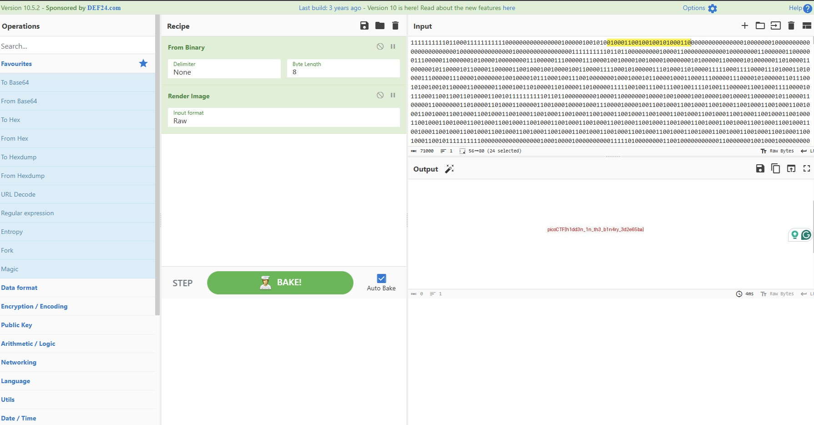

using `cyberchef` to analyse this file

after i put the `digits.bin` full of 0's and 1's

```bash
#FROM BINARY
ÿØÿà...something...JFIF
```
it a binary strings of image file

```bash
# RENDER IMAGE
found the flag
```


FLAG: `picoCTF[h1dd3n_1n_th3_b1n4ry_3d2e65ba]`
